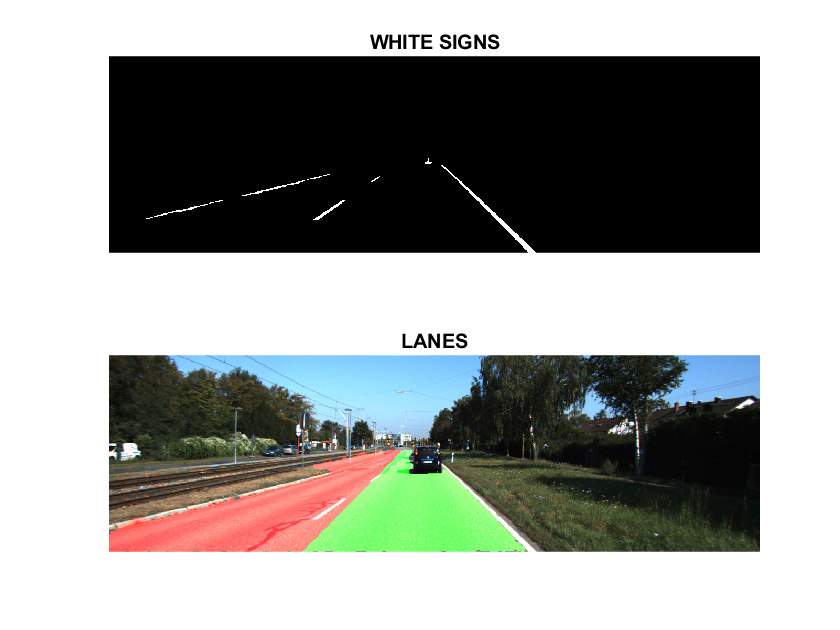

# STATIC LANE DETECTION

This program performs rudimentary lane detection on a set of images. It uses basic image processing techniques to identify asphalt surfaces, road signs, and lane centerlines without relying on machine learning algorithms. The program processes images from a specified folder, highlights detected lanes and displays white road signs.

## Features

- **Asphalt Detection**: Identifies asphalt surfaces using HSV color space thresholds and morphological operations.
- **Sign Detection**: Detects white road signs using grayscale thresholding and region properties.
- **Centerline Detection**: Identifies the mid-line separating two lanes based on region properties and line fitting.
- **Lane Highlighting**: Highlights detected lanes with different colors for better visualization.

 

  

## Usage

1. **Install Matlab**: if its not installed already
2. **Ensure** that the images to be processed are in a folder named *`Roads`*.
3. **Execute** the MATLAB script to process the images in the folder.

The program will display the processed images with highlighted lanes (green and red) and detected signs with white color.

## Note

This is a basic, non-ML lane detection program meant for demonstration purposes. It uses fixed thresholds and simple image processing techniques, and may not perform well under varying conditions.

## License

This project is open-source and available under the MIT License.
